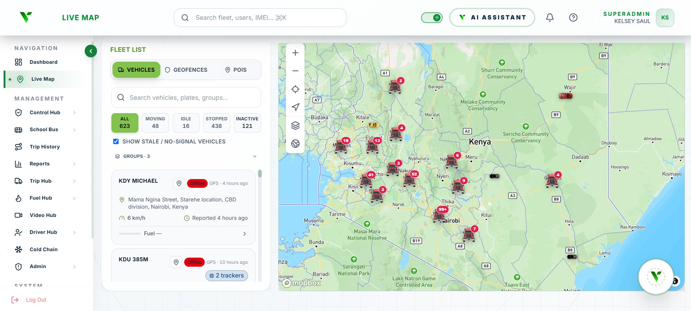
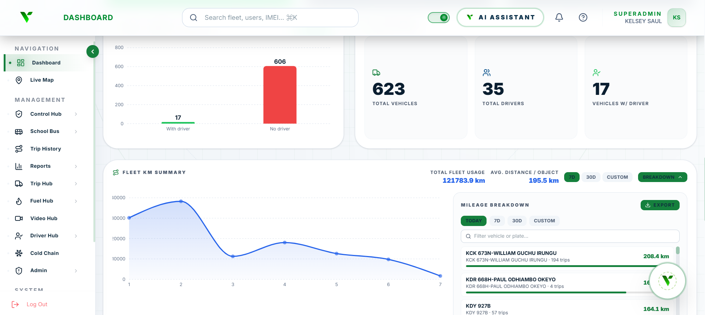

# Hi, I'm Kelsey Saul 

### Lead UI/UX Designer & Full-Stack Web Developer at Trackalways Africa

I design and build products end-to-end — from Figma prototypes to production React, NestJS, and Kotlin apps — with a focus on fleet-tracking, fintech, and payments tools for East African users.

[Portfolio](https://inkwell-sandy.vercel.app/#home) · [LinkedIn](https://www.linkedin.com/in/kelsey-nakitare-72562b1a8/) 

---

###  Tech Stack

| Category | Technologies |
| :--- | :--- |
| **Frontend & Design** |     |
| **Backend & APIs** |    |
| **Databases & Caching** |     |
| **Mobile** |   |
| **Maps & Telematics** |   |
| **Deployment & Tools** |    |

---

### 📁 Projects

####  [Venus — Fleet Management Platform](https://venus.trackalways.cloud/live-map)

Venus is the customer-facing brand of the Fleetpro fleet management platform: a real-time system for tracking and managing 600+ vehicles, devices, and drivers. I lead the design and development of "Venus OS" — its cross-platform UI — including the live map with geofencing and POIs, fleet KM analytics, fuel/video/driver hubs, and **Venus AI**, an integrated assistant that lets operators query vehicle statuses in natural language. *(Closed source — happy to walk through the architecture.)*

  
  

####  Carpool — Internal Ride & Fleet System

A fleet-tracking and internal ride-request system built on a NestJS backend, PostgreSQL with PostGIS for spatial queries, Redis for caching, and Traccar Cloud for telematics — with dedicated web and mobile codebases in a structured monorepo.

  
   
   
  
  

####  Zipp — Payments Super App

A Kenyan payments super app concept with a bold yellow/black/deep-blue brand: send to Zipp users or M-Pesa, Paybill/Till, QR payments, bills, travel booking, and **Palm Pay** palm-vein biometric authentication as its core differentiator. Designed mobile-first with Kotlin and Jetpack Compose in mind.

####  [Home Matchmaker](https://realestate-nu-gray.vercel.app/)

Full-stack student housing app with swipe-to-match discovery and automated in-app payments via the M-Pesa Daraja API (React, Node.js, Supabase).

####  [AfriFood](https://afrifood.vercel.app/)

Web and mobile recipe platform celebrating traditional African cuisine — database-driven with a custom relational schema in Supabase and heavily optimized image rendering.

####  Kenya Science Leadership Programme (https://www.kenyascienceleadershipprogram.co.ke/)

Web revamp and public-facing digital media assets for a national science leadership programme.

---

###  About Me

-  Competitive basketball player when I'm away from the keyboard
-  BSc in Business Information Technology, Kabarak University
-  Certified in Cisco Networking & Cybersecurity (CCNA) and IBM Data & AI Fundamentals
-  Ask me about UI/UX systems, React state management, M-Pesa integrations, or Kotlin/Compose workflows

---

### 📊 GitHub Stats

  

