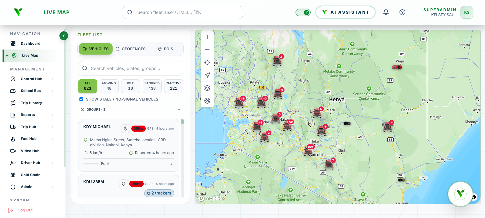
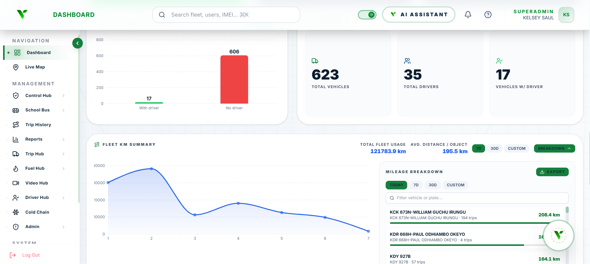

<h1 align="center">Hi, I'm Kelsey Saul 👋</h1>

<p align="center">
  <a href="https://git.io/typing-svg">
    
  </a>
</p>

<p align="center">
  I design and build products end-to-end  from Figma prototypes to production React, NestJS, and Kotlin apps  with a focus on fleet-tracking, fintech, and payments tools for East African users.
</p>

<p align="center">
  <a href="https://inkwell-sandy.vercel.app/#home">
    
  </a>
  <a href="https://www.linkedin.com/in/kelsey-nakitare-72562b1a8/">
    
  </a>
</p>

---

###  Tech Stack

| Category | Technologies |
| :--- | :--- |
| **Frontend & Design** |     |
| **Backend & APIs** |    |
| **Databases & Caching** |     |
| **Mobile** |   |
| **Maps & Telematics** |   |
| **Deployment & Tools** |    |

<p align="center">
  
</p>

---

### 📁 Projects

####  [Venus — Fleet Management Platform](https://venus.trackalways.cloud/live-map)

Venus is the customer-facing brand of the Fleetpro fleet management platform: a real-time system for tracking and managing 600+ vehicles, devices, and drivers. I lead the design and development of "Venus OS" its cross-platform UI  including the live map with geofencing and POIs, fleet KM analytics, fuel/video/driver hubs, and **Venus AI**, an integrated assistant that lets operators query vehicle statuses in natural language. *(Closed source — happy to walk through the architecture.)*

<p align="center">
  
  
</p>

<details>
<summary><b> Architecture Overview</b></summary>

<br/>

```mermaid
%%{init: {'theme':'base','themeVariables':{'fontFamily':'Segoe UI, sans-serif','fontSize':'15px','primaryColor':'#1f2233','primaryTextColor':'#e6e8f0','primaryBorderColor':'#3a3f5c','lineColor':'#6b7280','clusterBkg':'#16182400','clusterBorder':'#2a2e42','edgeLabelBackground':'#0d0f18'},'flowchart':{'curve':'basis','nodeSpacing':55,'rankSpacing':70,'padding':14}}}%%
flowchart LR
    GPS["🚗 &nbsp;GPS / Telematics<br/><b>600+ Units</b>"]
    TRACCAR["📡 &nbsp;Traccar Cloud<br/><i>Ingestion</i>"]
    API["⚙️ &nbsp;NestJS API<br/><b>Core Services</b>"]
    AI["🤖 &nbsp;Venus AI<br/><i>NL Query Engine</i>"]
    CACHE["⚡ &nbsp;Redis<br/><i>Cache</i>"]
    PG["🐘 &nbsp;PostgreSQL"]
    GIS["🗺️ &nbsp;PostGIS<br/><i>Geofences / POIs</i>"]
    WEB["🖥️ &nbsp;Venus OS<br/><b>Live Map + Analytics</b><br/>Fuel · Video · Driver Hubs"]

    GPS ==> TRACCAR ==> API
    API -.-> CACHE
    API --> PG
    API --> GIS
    API --> AI
    AI ==> WEB
    API ==> WEB

    classDef field fill:#1a2332,stroke:#2f81f7,stroke-width:2px,color:#dbeafe,rx:12,ry:12;
    classDef ingest fill:#1e2a1e,stroke:#4ade80,stroke-width:2px,color:#dcfce7,rx:12,ry:12;
    classDef core fill:#2a1e2e,stroke:#e0234e,stroke-width:2px,color:#fce7f3,rx:12,ry:12;
    classDef ai fill:#241b33,stroke:#a855f7,stroke-width:2px,color:#f3e8ff,rx:12,ry:12;
    classDef data fill:#1b2733,stroke:#38bdf8,stroke-width:2px,color:#e0f2fe,rx:12,ry:12;
    classDef client fill:#332a1a,stroke:#fbbf24,stroke-width:2px,color:#fef3c7,rx:12,ry:12;

    class GPS field;
    class TRACCAR ingest;
    class API,CACHE core;
    class AI ai;
    class PG,GIS data;
    class WEB client;
Gregs Veld Safaris
A safari booking and travel system designed and built to help international travellers—primarily from the UK—seamlessly explore and book custom safaris and vacations in Kenya.

Carpool — Internal Ride & Fleet System
A fleet-tracking and internal ride-request system built on a NestJS backend, PostgreSQL with PostGIS for spatial queries, Redis for caching, and Traccar Cloud for telematics  with dedicated web and mobile codebases in a structured monorepo.

Web dashboard

Mobile app

Code snippet
%%{init: {'theme':'base','themeVariables':{'fontFamily':'Segoe UI, sans-serif','fontSize':'15px','primaryColor':'#1f2233','primaryTextColor':'#e6e8f0','primaryBorderColor':'#3a3f5c','lineColor':'#6b7280','clusterBkg':'#16182400','clusterBorder':'#2a2e42','edgeLabelBackground':'#0d0f18'},'flowchart':{'curve':'basis','nodeSpacing':60,'rankSpacing':70,'padding':14}}}%%
flowchart TB
    WEB["🖥️ &nbsp;Web Dashboard"]
    MOBILE["📱 &nbsp;Mobile App"]
    NEST["⚙️ &nbsp;NestJS API<br/><i>Monorepo</i>"]
    REDIS["⚡ &nbsp;Redis<br/><i>Caching</i>"]
    TRACCAR["📡 &nbsp;Traccar Cloud<br/><i>Telematics</i>"]
    RIDES["🚕 &nbsp;Ride Requests"]
    SPATIAL["🗺️ &nbsp;PostGIS<br/><i>Spatial Queries</i>"]

    WEB ==> NEST
    MOBILE ==> NEST
    NEST -.-> REDIS
    NEST ==> TRACCAR
    NEST --> RIDES
    NEST --> SPATIAL

    classDef client fill:#1a2332,stroke:#2f81f7,stroke-width:2px,color:#dbeafe,rx:12,ry:12;
    classDef core fill:#2a1e2e,stroke:#e0234e,stroke-width:2px,color:#fce7f3,rx:12,ry:12;
    classDef svc fill:#241b33,stroke:#a855f7,stroke-width:2px,color:#f3e8ff,rx:12,ry:12;
    classDef data fill:#1b2733,stroke:#38bdf8,stroke-width:2px,color:#e0f2fe,rx:12,ry:12;

    class WEB,MOBILE client;
    class NEST core;
    class REDIS,TRACCAR svc;
    class RIDES,SPATIAL data;
Trackalways Africa
Official web presence and digital branding for Trackalways Africa. Designed and developed to showcase enterprise fleet telematics, fuel management, and AI-driven tracking solutions across East Africa with a sleek, high-conversion UI and responsive performance.

Cirqle Labs
Modern design studio and software venture landing page built with high-impact micro-interactions, responsive layout systems, and modern UI engineering standards to showcase product design and full-stack development capabilities.

Zipp — Payments Super App
A Kenyan payments super app concept with a bold yellow/black/deep-blue brand: send to Zipp users or M-Pesa, Paybill/Till, QR payments, bills, travel booking, and Palm Pay palm-vein biometric authentication as its core differentiator. Designed mobile-first with Kotlin and Jetpack Compose in mind.

Code snippet
%%{init: {'theme':'base','themeVariables':{'fontFamily':'Segoe UI, sans-serif','fontSize':'15px','primaryColor':'#1f2233','primaryTextColor':'#e6e8f0','primaryBorderColor':'#3a3f5c','lineColor':'#6b7280','clusterBkg':'#16182400','clusterBorder':'#2a2e42','edgeLabelBackground':'#0d0f18'},'flowchart':{'curve':'basis','nodeSpacing':55,'rankSpacing':70,'padding':14}}}%%
flowchart TB
    UI["📱 &nbsp;Compose UI<br/><i>Kotlin / Jetpack</i>"]
    PALM["🖐️ &nbsp;Palm Pay<br/><b>Palm-Vein Biometrics</b>"]
    WALLET["💳 &nbsp;Wallet / P2P"]
    QR["🔲 &nbsp;QR Payments"]
    BILLS["🧾 &nbsp;Bills & Travel"]
    MPESA["💸 &nbsp;M-Pesa<br/>Send · Paybill · Till"]

    UI --> WALLET
    PALM ==> WALLET
    UI --> QR
    UI --> BILLS
    WALLET ==> MPESA
    QR ==> MPESA
    BILLS ==> MPESA

    classDef app fill:#332f1a,stroke:#facc15,stroke-width:2px,color:#fef9c3,rx:12,ry:12;
    classDef bio fill:#241b33,stroke:#a855f7,stroke-width:2px,color:#f3e8ff,rx:12,ry:12;
    classDef core fill:#1a2332,stroke:#2f81f7,stroke-width:2px,color:#dbeafe,rx:12,ry:12;
    classDef rails fill:#1e2a1e,stroke:#4ade80,stroke-width:2px,color:#dcfce7,rx:12,ry:12;

    class UI app;
    class PALM bio;
    class WALLET,QR,BILLS core;
    class MPESA rails;
Kenya Science Leadership Programme
Web revamp and public-facing digital media assets for a national science leadership programme.

Home Matchmaker
Full-stack student housing app with swipe-to-match discovery and automated in-app payments via the M-Pesa Daraja API (React, Node.js, Supabase).

AfriFood
Web and mobile recipe platform celebrating traditional African cuisine — database-driven with a custom relational schema in Supabase and heavily optimized image rendering.

About Me
🏀 Competitive basketball player when I'm away from the keyboard

🎓 BSc in Business Information Technology, Kabarak University

📜 Certified in Cisco Networking & Cybersecurity (CCNA) and IBM Data & AI Fundamentals

💬 Ask me about UI/UX systems, React state management, M-Pesa integrations, or Kotlin/Compose workflows

📊 GitHub Stats
